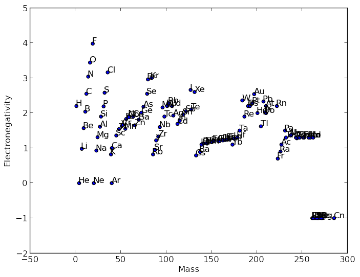
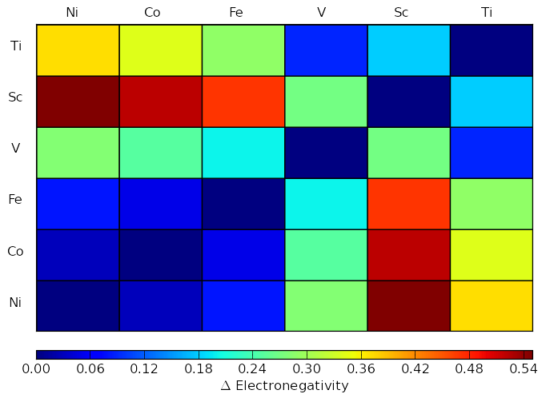

periodic-table-plotter
======================

Make a periodic table that plots 1-4 values per tile, easily configure grids 
of pair-wise elemental data (with 1-4 values per tile) and create 
pettifor-style trend plots.

Periodic table with one value per tile

Periodic table with two values per tile

Periodic table with three values per tile

Periodic table with four values per tile

Pettifor style map:

Grid of pair-wise elemental data:

